# STIX-LR analyses

- [Benchmark summary](results/2026_08-frequency_benchmark_summary)
- [1kg hexbin](results/2026_08-1kg-hexbin)
- [COSMIC density](results/2026_01-cosmic-density)
- [COSMIC hexbin](results/2026_08-cosmic-hexbin)
- [COLO ROC](results/2026_08-colo-roc)
- [COLO fraction of germline SVs with 0 pop. freq](results/2026_08-colo-roc)
- [HG002 hexbin](results/2026_08-hg002_cmrg-hexbin)
- [HG002 type and length](results/2026_08-hg002-missed)
- [HG002 CMRG density](results/2026_01-hg002_cmrg-density)
- [HG002 CMRG hexbin](results/2026_08-hg002_cmrg-hexbin)
- [HG002 CMRG type and length](results/2026_08-hg002_cmrg-missed)

## 1kg

Hexbin STIX-LR (min. reads = 5) v needLR (overlap=0.5)
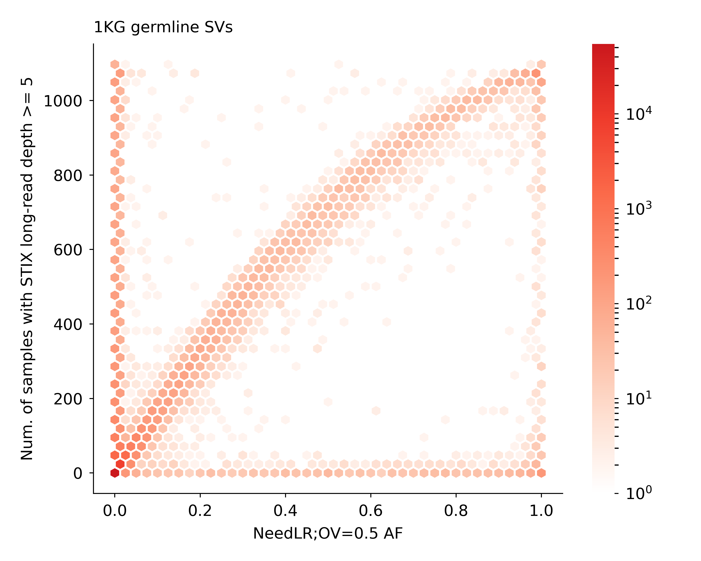

## COSMIC

Hexbin STIX-LR (min. reads = 5) v needLR (overlap=0.5)
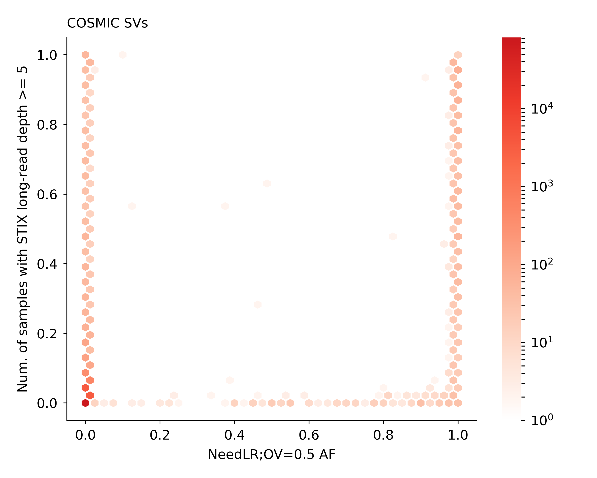

Hexbin STIX-LR (min. reads = 5) v SVAFotate (overlap = 0.9)
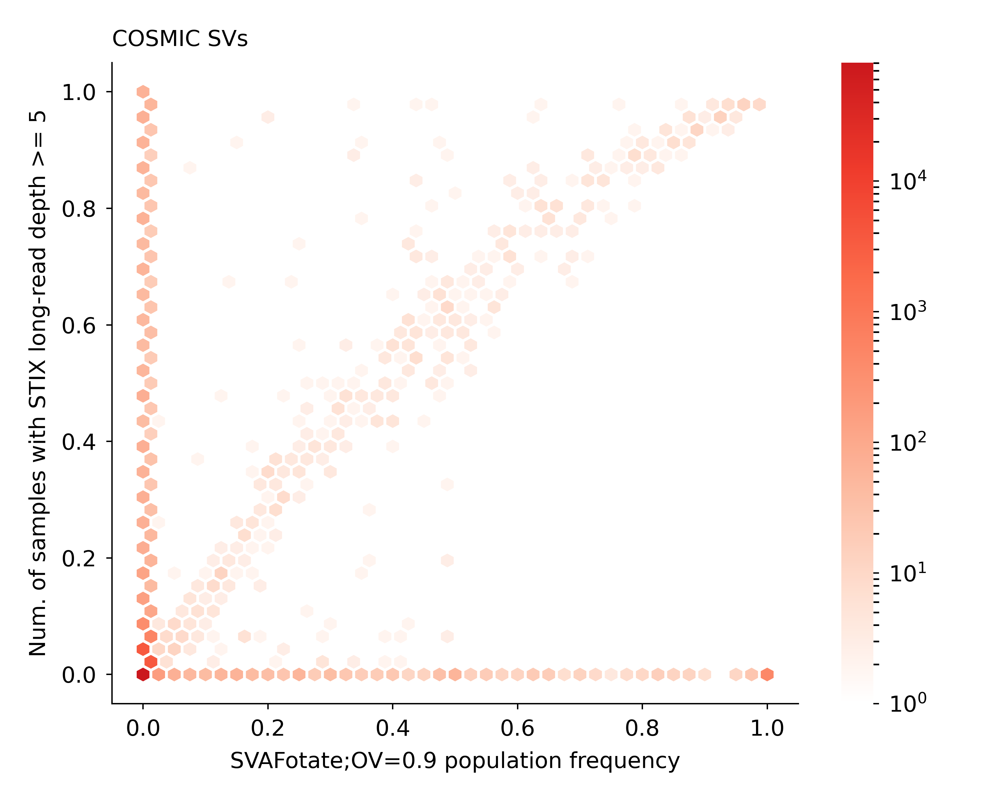

Number of SVs with 0 pop. freq
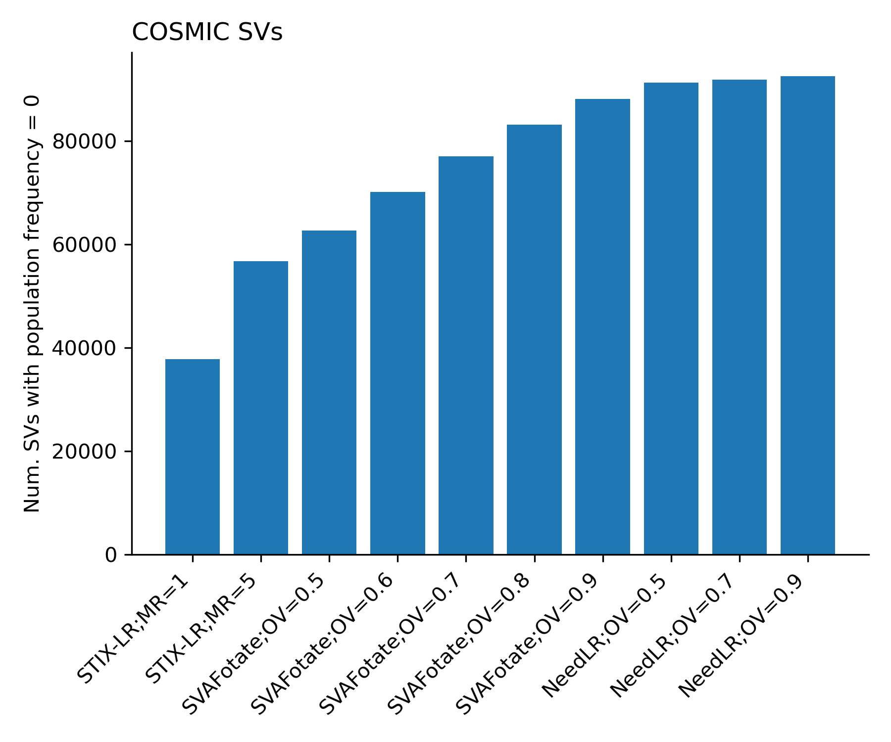

Density distribution of pop. freq > 0
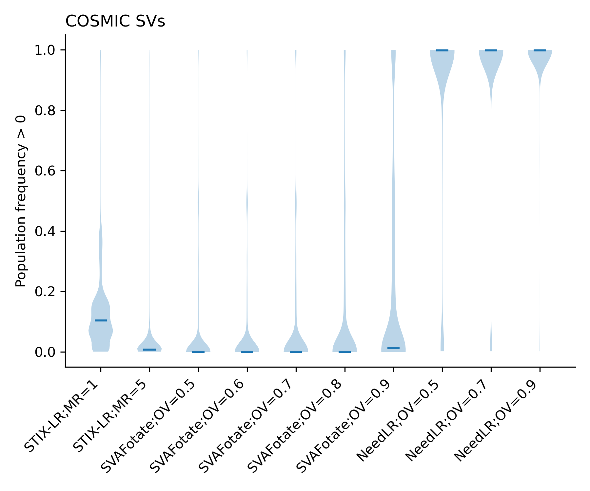

## COLO

Somatic SV classification

Fraction of missed germline variants

## HG002

Hexbin STIX-LR (min. reads = 5) v needLR (overlap=0.5)
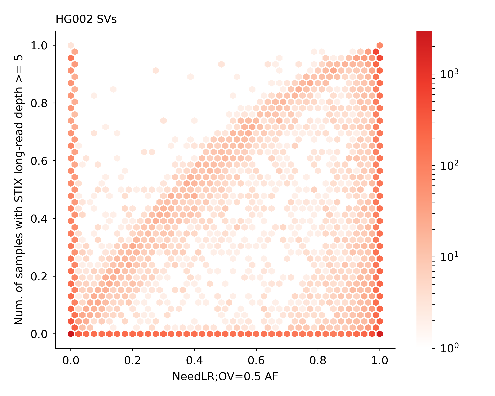

Hexbin STIX-LR (min. reads = 5) v SVAFotate (overlap=0.9)
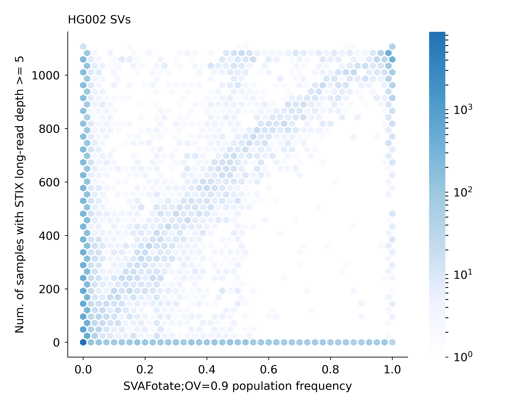

## HG002 CMRG

Hexbin 

Density

## Population/allele frequency bins
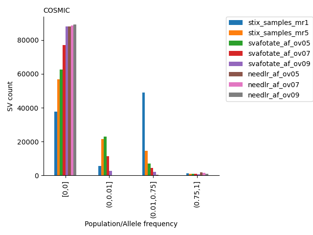
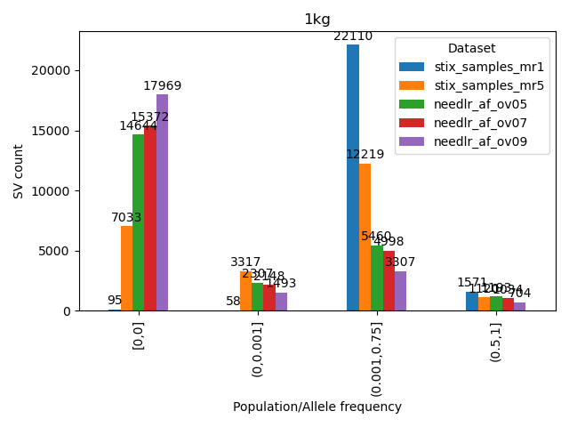
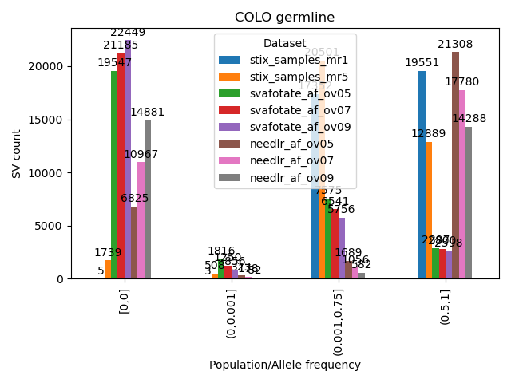
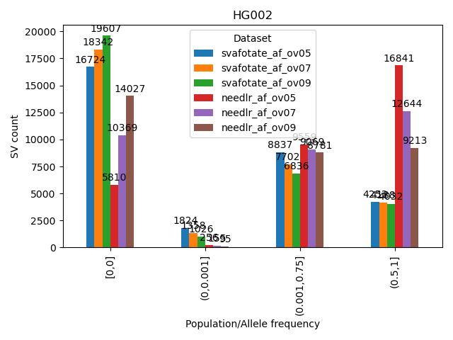
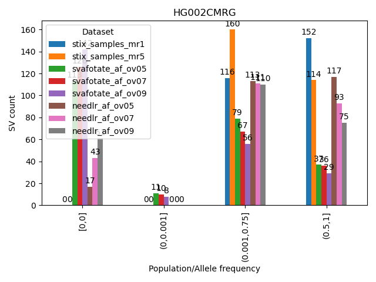
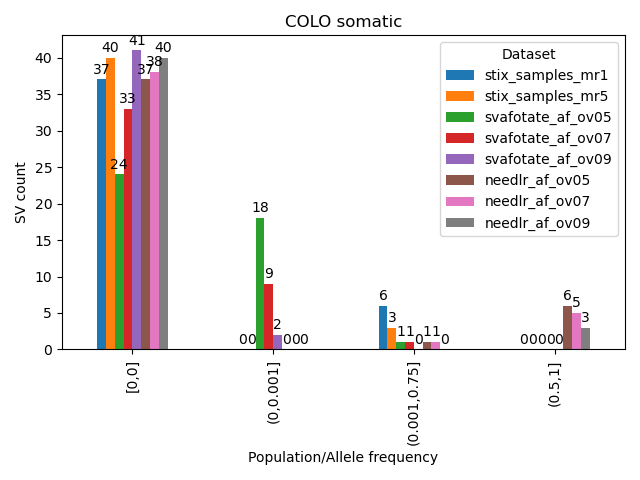

