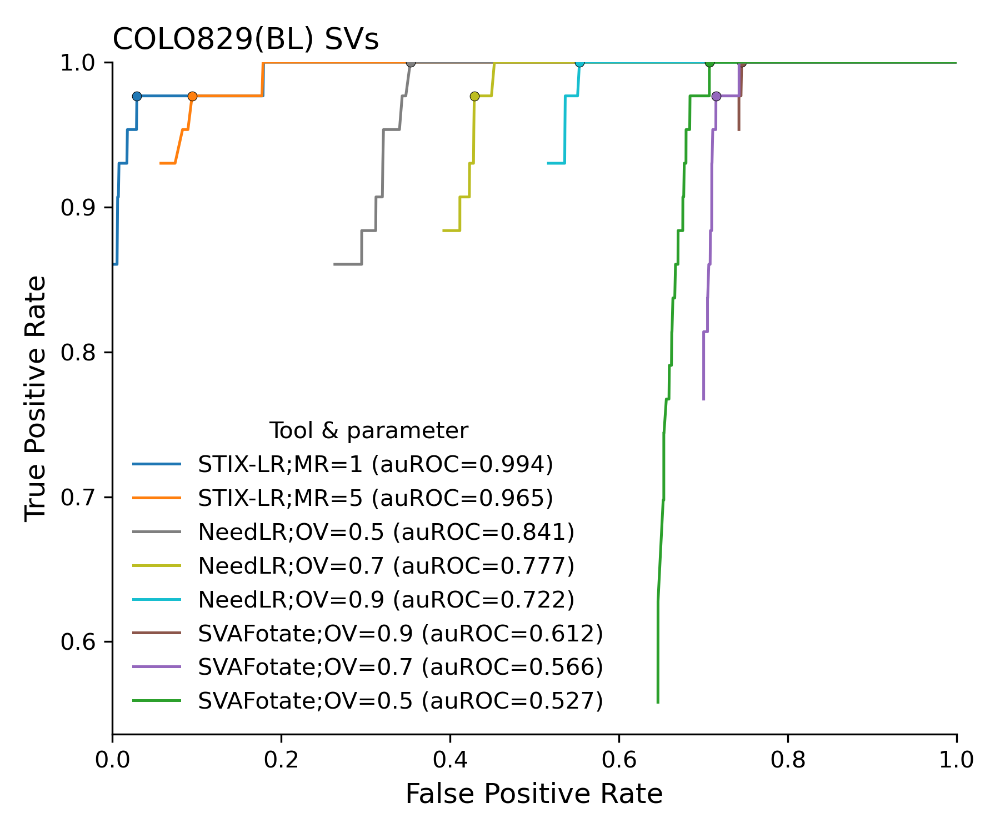
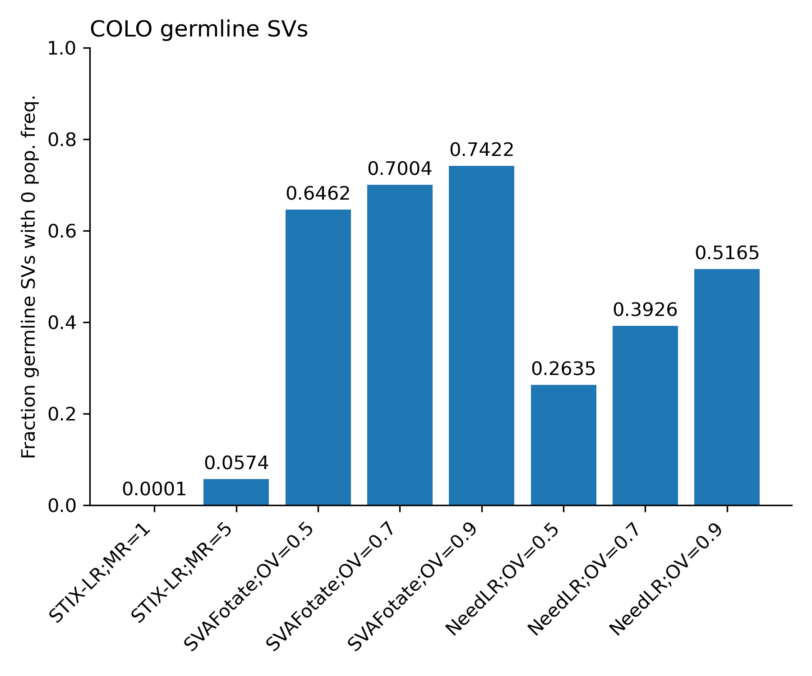
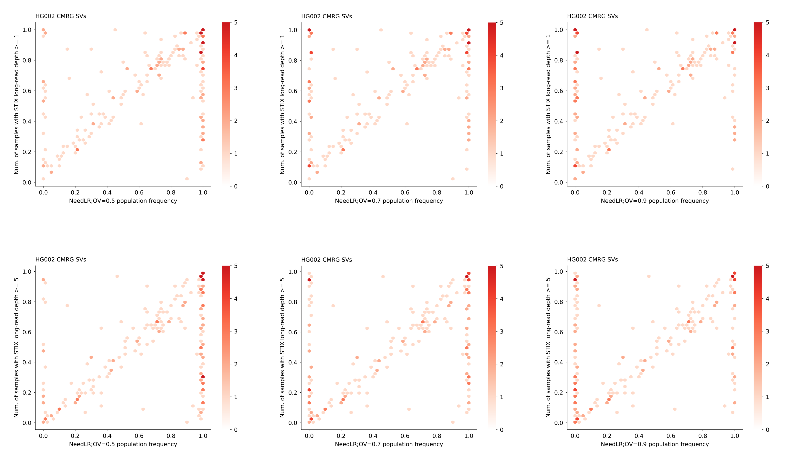
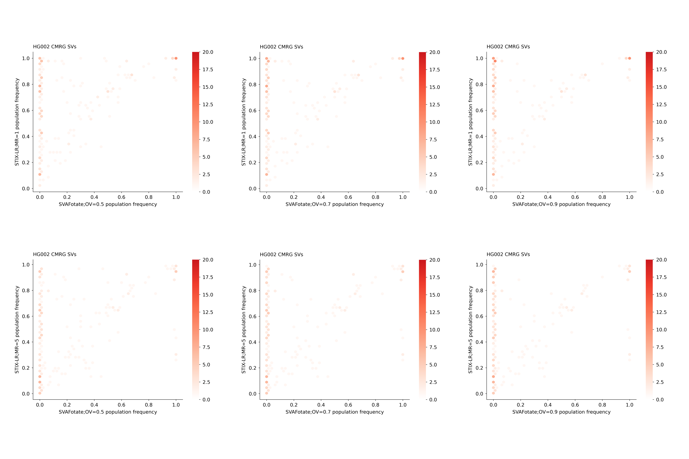
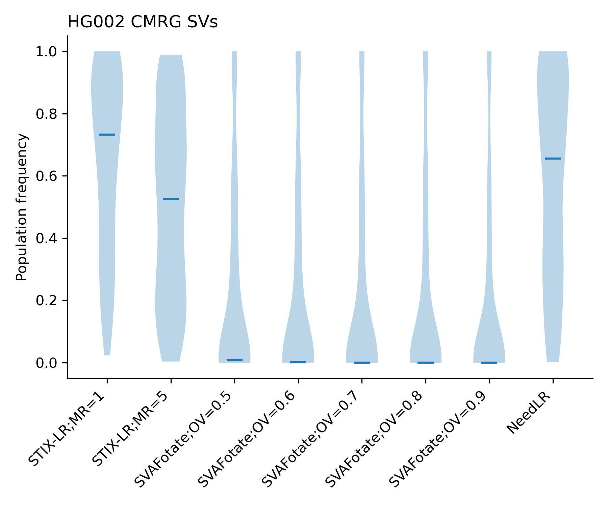
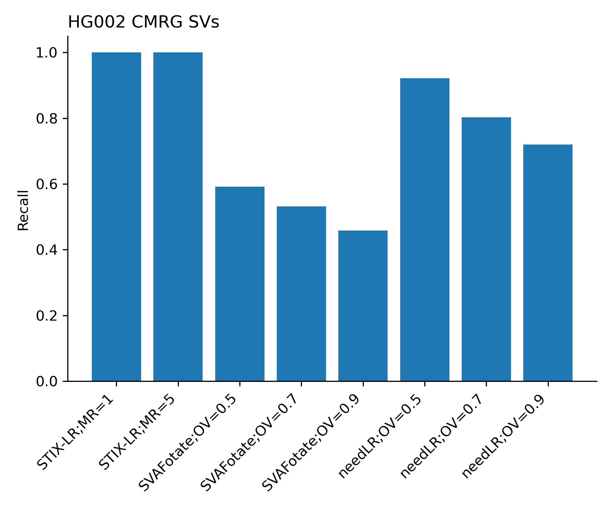

# STIX-LR analyses

- [COLO ROC](results/2026_08-colo-roc)
- [COLO fraction of germline SVs with 0 pop. freq](results/2026_08-colo-roc)
- [HG002 hexbin](results/2026_08-hg002_cmrg-hexbin)
- [HG002 CMRG density](results/2026_01-hg002_cmrg-density)
- [HG002 CMRG recall](results/2026_08-hg002_cmrg-recall)
- [HG002 CMRG hexbin](results/2026_08-hg002_cmrg-hexbin)
- [COSMIC density](results/2026_01-cosmic-density)

## COLO

Somatic SV classification

Fraction of missed germline variants

## HG002 CMRG

Hexbin 

Density

Recall (fraction of SVs with pop. freq. > 0)

